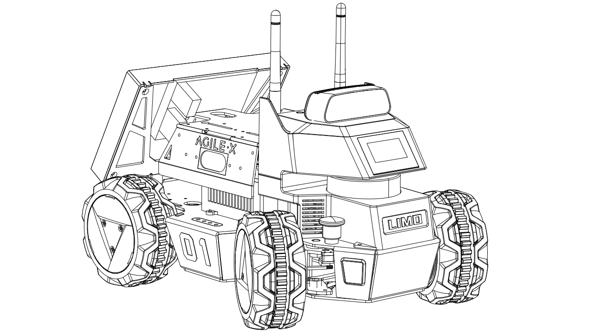
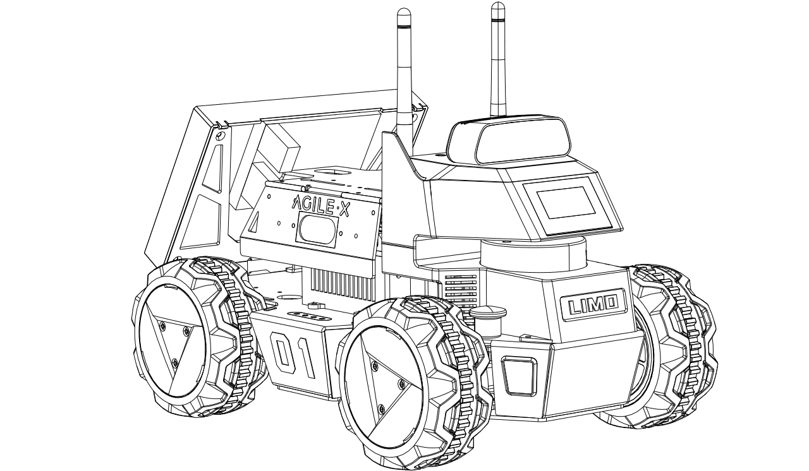
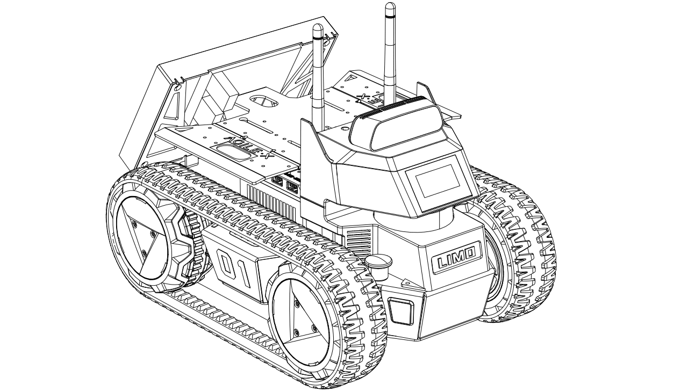
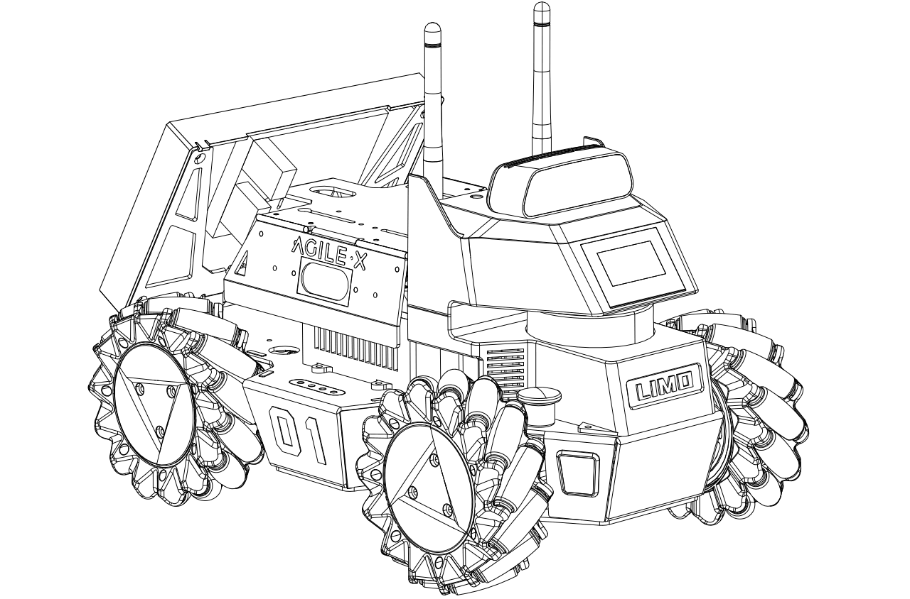
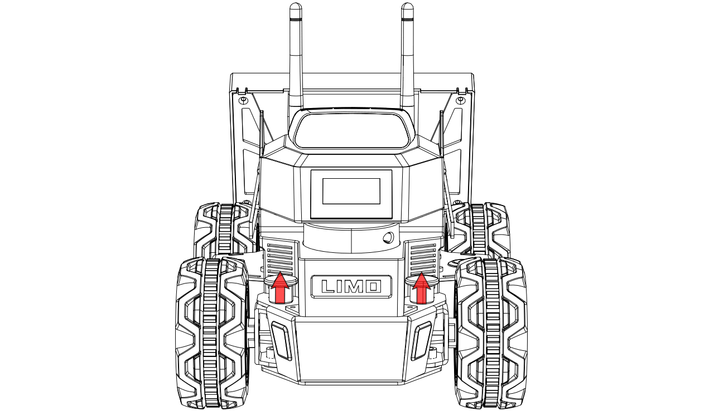
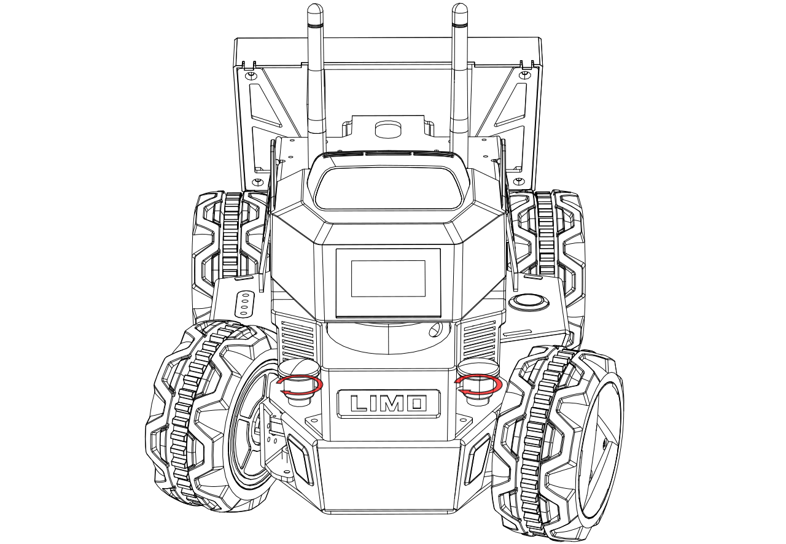
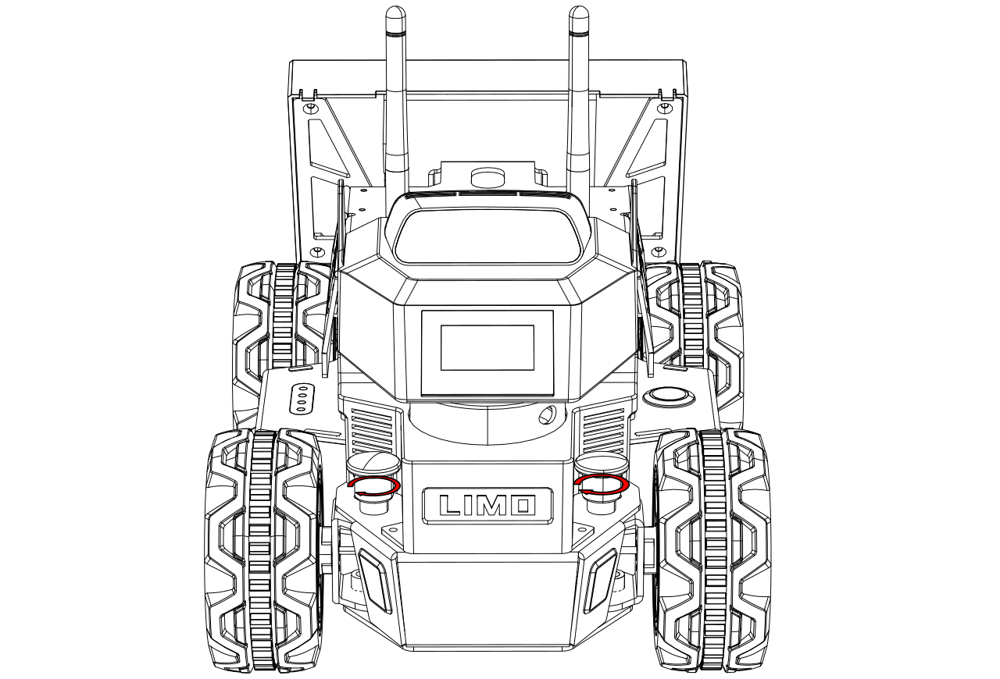
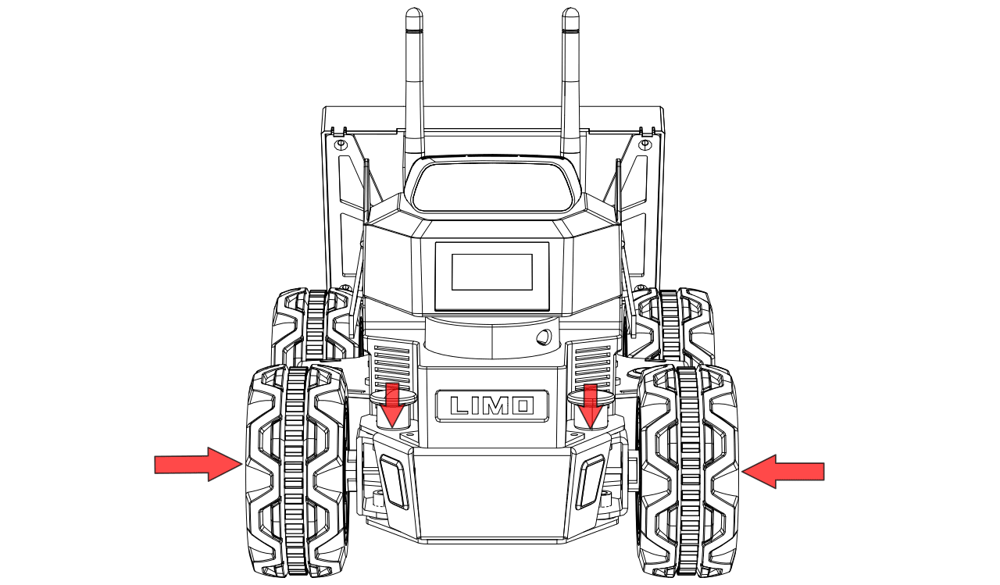
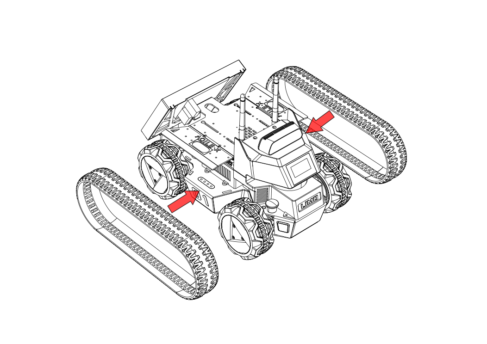

# Abstract

Your abstract text here.

# Table of Contents

- [Introduction](#introduction)
- [Setup](#setup)
- [Section 2](#section-2)
- [Conclusion](#conclusion)
- [References](#references)

# Introduction

Introduction text here.

## Subsection A

Subsection text here.

# Setup

## Drive Train
An interesting feature of the Limo bot is it's ability to change the wheels/drive train. For this guide we will be using the standard wheels in the Differential [^1] configuration. Below are the available options and some details to help determine which option might be best based on the task for the robot.

---
title: Steering Modes
---

Overview
========

+-------------+----------------+---------------------------------------+
| Latch       | Indicator      | Current Steering Mode or Status       |
| Status      | Color          |                                       |
+=============+================+=======================================+
| > Any       | > Blinking Red | > Low Battery or Main Controller      |
| >           |                | > Alarm                               |
| > :   -     | \-\-\-         |                                       |
|             | \-\-\-\-\-\-\- | \-\-\-\-\-                            |
|             | \-\-\-\-\-\--+ | \-\-\-\-\-\-\-\-\-\-\-\-\-\-\-\-\-\-\ |
|             |                | -\-\-\-\-\-\-\-\-\-\-\-\-\-\-\-\-\--+ |
|             | :   Solid Red  |                                       |
|             |                | :   LIMO Stopped Due to Error         |
+-------------+----------------+---------------------------------------+
| > Inserted  | > Yellow       | > Four-wheel Differential Drive or    |
| >           |                | > Tracked                             |
| > :   -     | \-\-\-         |                                       |
|             | \-\-\-\-\-\-\- | \-\-\-\-\-                            |
|             | \-\-\-\-\-\--+ | \-\-\-\-\-\-\-\-\-\-\-\-\-\-\-\-\-\-\ |
|             |                | -\-\-\-\-\-\-\-\-\-\-\-\-\-\-\-\-\--+ |
|             | :   Blue       |                                       |
|             |                | :   Mecanum                           |
+-------------+----------------+---------------------------------------+
| > Released  | > Green        | > Ackermann                           |
+-------------+----------------+---------------------------------------+

  --------------------------------------------------------------------------------------------------------------------------------------------------------------------------------------------------
  Ackermann                                        Four-wheel Differential                             Tracked                                        Mecanum
  ------------------------------------------------ --------------------------------------------------- ---------------------------------------------- ----------------------------------------------
  {.align-center}   {.align-center}   {.align-center}   {.align-center}

  --------------------------------------------------------------------------------------------------------------------------------------------------------------------------------------------------

-   **Ackermann:** The Ackermann steering geometry is a geometric
    arrangement of linkages in the steering of a car or other vehicle
    designed to solve the problem of wheels on the inside and outside of
    a turn needing to trace out circles of different radii.
    [\[Wikipedia\]](https://en.wikipedia.org/wiki/Ackermann_steering_geometry)
-   **Four-wheel Differential:** A differential wheeled robot is a
    mobile robot whose movement is based on two separately driven wheels
    placed on either side of the robot body. It can thus change its
    direction by varying the relative rate of rotation of its wheels and
    hence does not require an additional steering motion. Robots with
    such a drive typically have one or more caster wheels to prevent the
    vehicle from tilting.
    [\[Wikipedia\]](https://en.wikipedia.org/wiki/Differential_wheeled_robot)
-   **Tracked:** Tank steering systems allow a tank, or other continuous
    track vehicle, to turn. Because the tracks cannot be angled relative
    to the hull (in any operational design), steering must be
    accomplished by speeding one track up, slowing the other down (or
    reversing it), or a combination of both.
    [\[Wikipedia\]](https://en.wikipedia.org/wiki/Tank_steering_systems)
-   **Mecanum:** The mecanum wheel is an omnidirectional wheel design
    for a land-based vehicle to move in any direction.
    [\[Wikipedia\]](https://en.wikipedia.org/wiki/Mecanum_wheel)

Switching Steering Modes
========================

Switching to Ackermann
----------------------

Pull up the latches on both sides, turn 30 degrees clockwise to make the
longer line on both latches points to the front of the vehicle body, and
then they will be stuck. When the vehicle light turns solid green, the
robot is in Ackermann steering mode.

::: {.container .no-table}
  -------------------------------------------------- -------------------------------------------------
  {.align-center}   {.align-center
                                                     width="90.0%"}

  -------------------------------------------------- -------------------------------------------------
:::

Switching to Differential
-------------------------

Pull up the latches on both sides, turn 30 degrees clockwise to make the
shorter line on the two latches points to the front of the vehicle body.
At this point, it is in insertion state. Fine-tune the tire angle to
align the hole so that the latch is inserted. When the vehicle light
turns solid yellow, the the robot is in Four-wheel Differential steering
mode.

::: {.container .no-table}
  ---------------------------------------------------- -----------------------------------------------------
  {.align-center   {.align-center}
  width="85.0%"}                                       

  ---------------------------------------------------- -----------------------------------------------------
:::

Switching to Tracked
--------------------

With the robot in four-wheel differential mode, the track can be put on
directly. It is recommended to put the track on the rear wheel with
small space first.

::: {.warning}
::: {.title}
Warning
:::

When using Tracked mode, please lift the doors on both sides to prevent
scratches.Ackerman - traditional drive train that steers like an automobile, the two front wheels steer, all four wheels drive together 
Differential - the left side and right side drive independent, no wheels steer, to turn one side must move forward while the other moves backwards, advantage over Ackerman is the robot can turn in place
Tracked - the same as differential but with tracks instead of wheels allowing for better traction in loose terrain 
Mecanum - mecanum wheels have rollers that are rotated 45 degrees to the axis of rotation, they allow the robot to strafe increasing maneuverability, because the robot is always on a roller, mecanum drive trains lack pushing power and are not well suited to climb inclines  

:::

{.align-center}

Switching to Mecanum
--------------------

First remove the hubcaps and tires, leaving only the hub motors. Then,
ensuring that the small roller of each Mecanum wheel is facing the
center of the body, install the Mecanum wheel with the included M3\*5
screws.

::: {.container .no-table}
  ------------------------------------------------ ------------------------------------------------ ------------------------------------------------
  {.align-center}   {.align-center}   {.align-center}

  ------------------------------------------------ ------------------------------------------------ ------------------------------------------------
:::

::: {.note}
::: {.title}
Note
:::

When switching to the Mecanum steering mode, make sure that each Mecanum
wheel is installed at the angle shown above in the third picture.
:::


[^1]: Navigation commands in this guide will have the drive train specified for example ``` 
roslaunch limo_bringup limo_navigation_diff.launch``` would be for the differential drive train. To use tracked you would execute ```roslaunch limo_bringup limo_navigation_tracked.launch```


Section 1 text here.

## Install no machine
Use the following link https://downloads.nomachine.com/download-enterprise/#NoMachine-Enterprise-Client to download and install the appropriate client for your operating system.

## Create access point

A wireless network that both the student and the robot can connect to is not always available and often when available has security measures that prevent peer to peer connections.  To overcome this issue, the robot can create a wireless network to allow the student to connect to and interact with the robot.

### Install Hostapd
```bash
sudo apt-get install hostapd
```
#### edit hostapd.conf
```shell
sudo nano /etc/hostapd/hostapd.conf
```
```shell
interface=wlan0
driver=nl80211
ssid=limo_bot
hw_mode=a
channel=149
macaddr_acl=0
auth_algs=1
ignore_broadcast_ssid=0
wpa=3
wpa_passphrase=limo_bot
wpa_key_mgmt=WPA-PSK
wpa_pairwise=TKIP
rsn_pairwise=CCMP

```

#### edit hostapd daemon file
```shell
sudo nano /etc/default/hostapd
```

```
DAEMON_CONF=/etc/hostapd/hostapd.conf
```

### Install DNSMASQ
```shell
sudo apt-get install dnsmasq
```
#### edit dnsmasq conf
```
sudo nano /etc/dnsmasq.conf
```
add the following lines to the bottom
```text
interface=wlan0  
dhcp-range=192.168.38.2,192.168.38.10,255.255.255.0,12h  
no-hosts  
addn-hosts=/etc/hosts.dnsmasq
```

#### set up the interface
```
sudo nano /etc/network/interfaces.d/wlan0
```
add
```text
auto wlan0
iface wlan0 inet static
address 192.168.38.1
netmask 255.255.255.0
```

Reboot the robot and verify that limo_bot SSID is visible when scanning for wireless networks.


#### Connect to the robot

Connect to the limo_bot network using lime_bot as the key.
You should now be able to ssh or remote desktop connect to the limo bot at 192.168.38.1.

Launch NoMachine and create a new connection by clicking the Add button.

![[Pasted image 20231202223002.png]]
Select Address and enter 192.168.38.1 into the address field.
![[Pasted image 20231202223220.png]]
Click Connect.

FINISH WITH THE BOT 


# SLAM and Navigation


Section 2 text here.

## Using LiDAR

### Creating and saving a map

Subsection text here.

## Navigating with map

Subsection text here.

## Recording a path

Subsection text here.

## Autonomous path following

Subsection text here.


## Using Vision

### Creating and saving a map

Subsection text here.

## Navigating with map

Subsection text here.

## Recording a path

Subsection text here.

## Autonomous path following

# Conclusion

Your conclusion text here.

# References

Your bibliography or list of references here.

