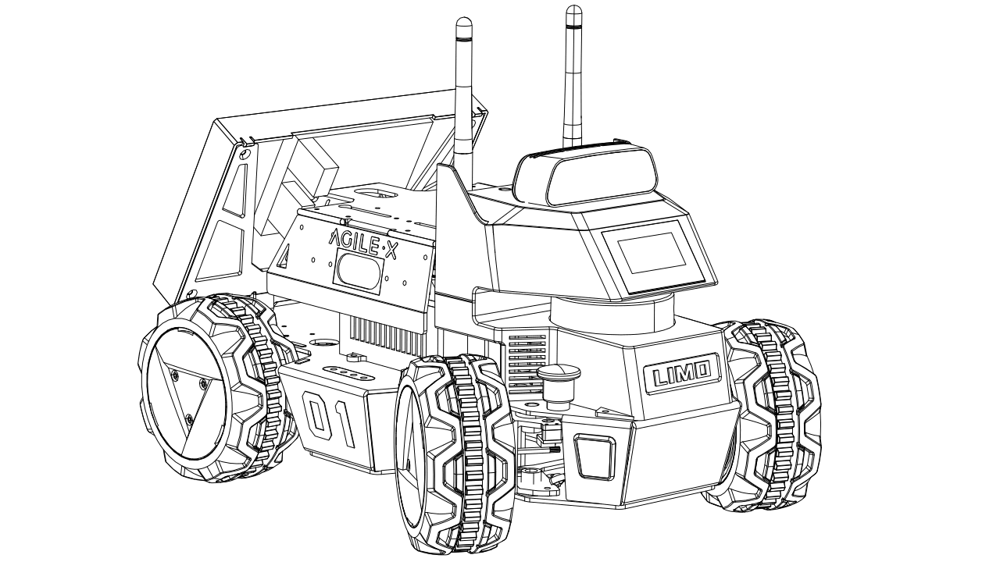
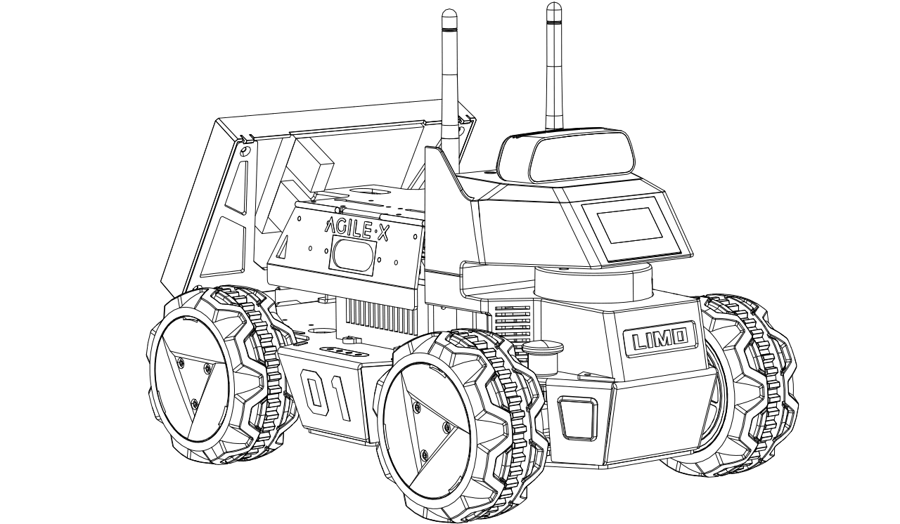
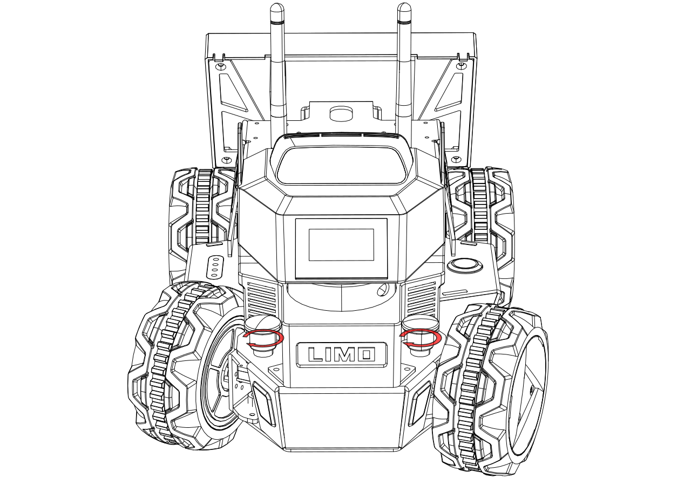

# Abstract


# Table of Contents

- [Introduction](#introduction)
- [Setup](#setup)
- [SLAM and Navigation](#slam-and-navigation)
- [Conclusion](#conclusion)
- [References](#references)

# Introduction


# Setup

## Mobile App Install

### Android

Download and install the controller application to your mobile phone using the QR code below.


Tap on the Bluetooth icon in the upper left to open the connection menu.


Select the connection with the same name as the one on the front of your robot.


Once connected, you will see the battery level of your robot as well as the connection symbol. You should also be able to control your robot. Find information on controlling your robot using the mobile app in the App Operation Guide.


### iOS

Download and install the controller application to your mobile phone using the QR code below.


> **_NOTE:_** If you have difficulty installing the application, you can search for AgileX on the App Store instead.

Select the connection with the same name as the one on the front of your robot.


Once connected, you will see the battery level of your robot as well as the connection symbol. You should also be able to control your robot. Find information on controlling your robot using the mobile app in the App Operation Guide.


Continue on to the Mobile App Usage for details on how to control and configure your LIMO with the newly installed app.

## Drive Train
An interesting feature of the Limo bot is it's ability to change the wheels/drive train. For this guide we will be using the standard wheels in the Differential [^1] configuration. Below are the available options and some details to help determine which option might be best based on the task for the robot.

### Overview

| Latch  Status     | Indicator  Color    | Current Steering Mode or Status       |
| --- | --- | --- |
| Any       | Blinking Red | Low Battery or Main Controller  Alarm    |
|           | Solid Red  |          LIMO Stopped Due to Error         |
| Inserted  | Yellow       | Four-wheel Differential Drive or Tracked   |
|           | Blue       | Mecanum                                      |
| Released  | Green      | Ackermann                           |


  |Ackermann|Four-wheel Differential|Tracked|Mecanum|
  | --- | --- | --- | --- |
  | | |||

-   **Ackermann:** The Ackermann steering geometry is a geometric
    arrangement of linkages in the steering of a car or other vehicle
    designed to solve the problem of wheels on the inside and outside of
    a turn needing to trace out circles of different radii.
    [\[Wikipedia\]](https://en.wikipedia.org/wiki/Ackermann_steering_geometry)
-   **Four-wheel Differential:** A differential wheeled robot is a
    mobile robot whose movement is based on two separately driven wheels
    placed on either side of the robot body. It can thus change its
    direction by varying the relative rate of rotation of its wheels and
    hence does not require an additional steering motion. Robots with
    such a drive typically have one or more caster wheels to prevent the
    vehicle from tilting.
    [\[Wikipedia\]](https://en.wikipedia.org/wiki/Differential_wheeled_robot)
-   **Tracked:** Tank steering systems allow a tank, or other continuous
    track vehicle, to turn. Because the tracks cannot be angled relative
    to the hull (in any operational design), steering must be
    accomplished by speeding one track up, slowing the other down (or
    reversing it), or a combination of both.
    [\[Wikipedia\]](https://en.wikipedia.org/wiki/Tank_steering_systems)
-   **Mecanum:** The mecanum wheel is an omnidirectional wheel design
    for a land-based vehicle to move in any direction.
    [\[Wikipedia\]](https://en.wikipedia.org/wiki/Mecanum_wheel)

### Switching Steering Modes


#### Switching to Ackermann

Pull up the latches on both sides, turn 30 degrees clockwise to make the
longer line on both latches points to the front of the vehicle body, and
then they will be stuck. When the vehicle light turns solid green, the
robot is in Ackermann steering mode.

   
  


#### Switching to Differential

Pull up the latches on both sides, turn 30 degrees clockwise to make the
shorter line on the two latches points to the front of the vehicle body.
At this point, it is in insertion state. Fine-tune the tire angle to
align the hole so that the latch is inserted. When the vehicle light
turns solid yellow, the the robot is in Four-wheel Differential steering
mode.

  

#### Switching to Tracked

With the robot in four-wheel differential mode, the track can be put on
directly. It is recommended to put the track on the rear wheel with
small space first.


> **_WARNING:_** When using Tracked mode, please lift the doors on both sides to prevent
scratches.Ackerman - traditional drive train that steers like an automobile, the two front wheels steer, all four wheels drive together 
Differential - the left side and right side drive independent, no wheels steer, to turn one side must move forward while the other moves backwards, advantage over Ackerman is the robot can turn in place
Tracked - the same as differential but with tracks instead of wheels allowing for better traction in loose terrain 
Mecanum - mecanum wheels have rollers that are rotated 45 degrees to the axis of rotation, they allow the robot to strafe increasing maneuverability, because the robot is always on a roller, mecanum drive trains lack pushing power and are not well suited to climb inclines  


#### Switching to Mecanum

First remove the hubcaps and tires, leaving only the hub motors. Then,
ensuring that the small roller of each Mecanum wheel is facing the
center of the body, install the Mecanum wheel with the included M3\*5
screws.


> **_NOTE:_** When switching to the Mecanum steering mode, make sure that each Mecanum
wheel is installed at the angle shown above in the third picture.


[^1]: Navigation commands in this guide will have the drive train specified for example ``` 
roslaunch limo_bringup limo_navigation_diff.launch``` would be for the differential, Mecanum, and tracked. To use ackerman you would execute ```roslaunch limo_bringup limo_navigation_ackerman.launch```

<div style="page-break-after: always;"></div>

## Install no machine
Use the following link [NoMachine](https://downloads.nomachine.com/download-enterprise/#NoMachine-Enterprise-Client) to download and install the appropriate client for your operating system.

### Create access point

A wireless network that both the student and the robot can connect to is not always available and often when available has security measures that prevent peer to peer connections.  To overcome this issue, the robot can create a wireless network to allow the student to connect to and interact with the robot.

#### Install Hostapd
```bash
sudo apt-get install hostapd
```
#### edit hostapd.conf
```shell
sudo nano /etc/hostapd/hostapd.conf
```
```shell
interface=wlan0
driver=nl80211
ssid=limo_bot
hw_mode=a
channel=149
macaddr_acl=0
auth_algs=1
ignore_broadcast_ssid=0
wpa=3
wpa_passphrase=limo_bot
wpa_key_mgmt=WPA-PSK
wpa_pairwise=TKIP
rsn_pairwise=CCMP

```

#### edit hostapd daemon file
```shell
sudo nano /etc/default/hostapd
```

```
DAEMON_CONF=/etc/hostapd/hostapd.conf
```

### Install DNSMASQ
```shell
sudo apt-get install dnsmasq
```
#### edit dnsmasq conf
```
sudo nano /etc/dnsmasq.conf
```
add the following lines to the bottom
```text
interface=wlan0  
dhcp-range=192.168.38.2,192.168.38.10,255.255.255.0,12h  
no-hosts  
addn-hosts=/etc/hosts.dnsmasq
```

#### set up the interface
```
sudo nano /etc/network/interfaces.d/wlan0
```
add
```text
auto wlan0
iface wlan0 inet static
address 192.168.38.1
netmask 255.255.255.0
```

Reboot the robot and verify that limo_bot SSID is visible when scanning for wireless networks.


#### Connect to the robot

Connect to the limo_bot network using lime_bot as the key.
You should now be able to ssh or remote desktop connect to the limo bot at 192.168.38.1.

Launch NoMachine and create a new connection by clicking the Add button.


Select Address and enter 192.168.38.1 into the address field.


Click Connect.


The default user name is ```agilex``` and password ```agx```
On the first connection, you will prompted with several options for this connection, you can select the defaults and click Ok.


You are now connected.

<div style="page-break-after: always;"></div>

# SLAM and Navigation

The following sections assume you are remotely connected to the Limo or using the build-in screen with a keyboard.

> **_NOTE:_** Drive slowly when mapping an environment. Driving too quickly will degrade the mapping quality.

## Using LiDAR with GMapping

GMapping is a commonly used open source SLAM algorithm based on the filtering SLAM framework. GMapping effectively utilizes the wheel odometry information and does not require high frequency of laser LiDAR. When mapping small environments, little processing power is required is low and the accuracy is high.

Run each of the following commands in a new terminal.

**Terminal 1**

 ```bash 
 roslaunch limo_bringup limo_start.launch pub_odom_tf:=false
 ```

**Terminal 2**

 ```bash 
 roslaunch limo_bringup limo_gmapping.launch
 ```

 After launching successfully, RViz will be opened and display something like the image below.

 

Drive the robot around slowly to map out the environment.

### Saving a map

When finished mapping, do the following to save the map to the specified directory:

Switch to the directory where you need to save the map. For example, if you want to save the map to ~/agilex_ws/src/limo_ros/limo_bringup/maps/, enter the command:

```bash
cd ~/agilex_ws/src/limo_ros/limo_bringup/maps/
```


After switching to ~/agilex_ws/limo_bringup/maps, enter the command:

```bash
rosrun map_server map_saver -f map1
```

This calls the map_saver script from the map_server package to save the map to a file in the current directory, in this case map1 in ~/agilex_ws/limo_bringup/maps.

Change the map1 argument to the filename you would like to use for the map.

## Using vision with Cartographer

Cartographer is a set of SLAM algorithms based on image optimization launched by Google. The main goal of this algorithm is to achieve low computing resource consumption while simultaneously mapping and localizing in real-time. The algorithm is divided into two parts. The first part is called Local SLAM. This part establishes and maintains a series of submaps through a laser scan frame, and the so-called submap is a series of Grid Maps. The second part of the algorithm, called Global SLAM, is to perform closed-loop detection through Loop Closure to eliminate accumulated errors: when a submap is built, no new laser scans will be inserted into the submap. The algorithm will add the submap to the closed-loop detection.

> **_NOTE:_** Use Ctrl + C command to end all the processes before running the below commands.

Run each of the following commands in a new terminal.

**Terminal 1**

 ```bash 
 roslaunch limo_bringup limo_start.launch pub_odom_tf:=false
 ```

**Terminal 2**

 ```bash 
 roslaunch limo_bringup limo_cartographer.launch
 ```

After launching successfully, RViz will be opened and display the map.

Drive the robot around slowly to map out the environment. The result should look something like:

 

### Saving the map

Call the /finish_trajectory service to notify Cartographer that no further data should be accepted:

```bash
 rosservice call /finish_trajectory 0
```
Serialize the map and save its current state by calling the /write_state service:
```bash
rosservice call /write_state "{filename: '/home/agilex/agilex_ws/src/limo_ros/limo_bringup/maps/map2.pbstream'}"
```

Convert pbstream to pgm and yaml using the cartographer_pbstream_to_ros_map script:

```bash
rosrun cartographer_ros cartographer_pbstream_to_ros_map -map_filestem=/home/agilx/agilex_ws/src/limo_ros/limo_bringup/maps/map2 -pbstream_filename=~/agilex_ws/src/limo_ros/limo_bringup/maps/map2.pbstream -resolution=0.05
```

This command generates the corresponding pgm and yaml and saves them to the directory:

```bash
/home/agilex/agilex_ws/src/limo_ros/limo_bringup/maps/map2.pbstream
```

## Navigating with saved map

The move_base package provides an implementation of an action that, given a goal in the world, will attempt to reach it with a mobile base. The move_base node links together a global and local planner to accomplish its global navigation task. The move_base node also maintains two costmaps, one for the global planner, and one for a local planner (see the costmap_2d package) that are used to accomplish navigation tasks.

> **_NOTE:_** Use Ctrl + C command to end all the processes before running the below commands.

**Terminal 1**

 ```bash 
 roslaunch limo_bringup limo_start.launch pub_odom_tf:=false
 ```

Before launching the navigation, you will need to edit the launch file to specify the saved map you would like to load.
Open the launch file located at **/home/agilex/agilex_ws/src/limo_ros/limo_bringup/launch/limo_navigation_diff.launch** and edit the following line:
```xml
<node pkg="map_server" type="map_server" name="map_server" args="$(find limo_bringup)/maps/map2.yaml" output="screen">
<!--                                                             ^^^^^^^^^^^^^^^^^^^^^^^^^^^^^^^^^^^^               -->
```
Change map2.yaml to the name of the map you saved when mapping the environment. Save the file.

 **Terminal 2**
```bash
roslaunch limo_bringup limo_navigation_diff.launch
```
After launching successfully, RViz will be opened and display something like the image below.


If after launching the navigation the laser scan display does not quite overlap with the map, meaning that the robot does not have a good estimate of where it is. To correct this, use the **2D Pose Estimate** tool in RViz to publish an approximate position of the robot. When the laser scan overlaps the map, the correction is complete.


Once the laser scan lines up with the environment, meaning the red dotted line aligns with a wall or obstacle, you can use the **2D Nav Goal** to select a desired navigation point on the map.


A purple path will be displayed in the map indicating the planned path, and the robot will automatically navigate to the goal.


<div style="page-break-after: always;"></div>

# Conclusion


# References


